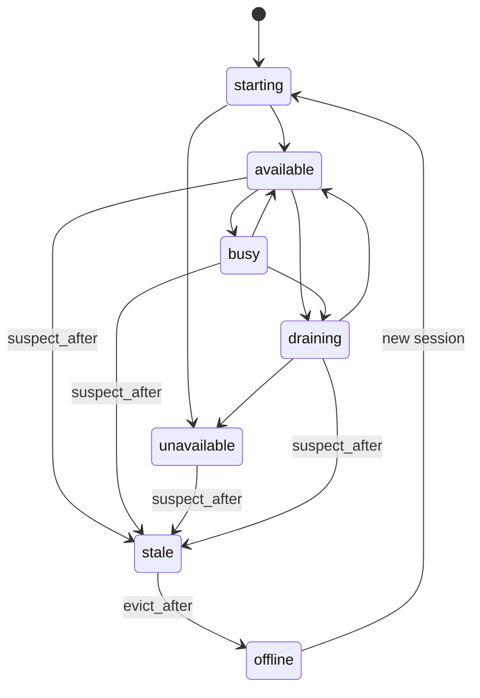
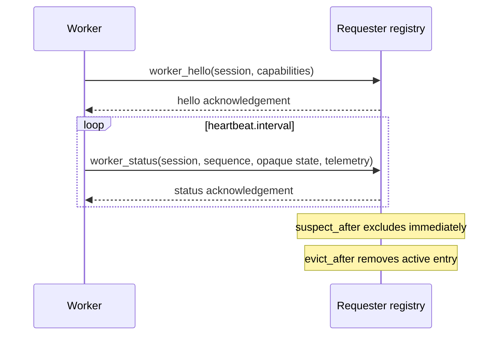
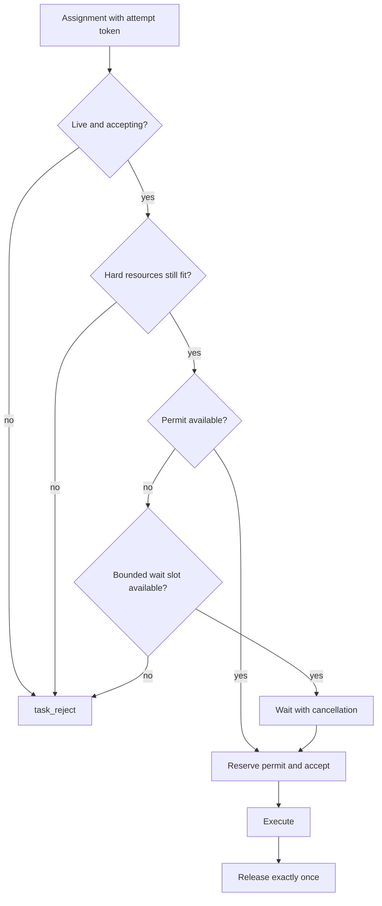
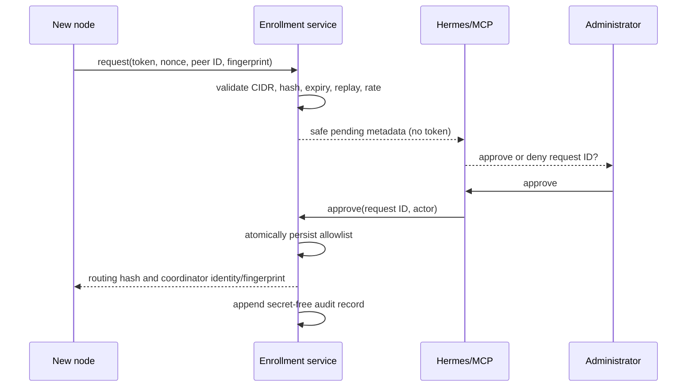

# Phase 2 architecture and decisions

Status: implemented design contract
Protocol generation: 2
Storage format: additive Phase 1-compatible JSON

## Context

Caduceus remains a symmetric, local-first fabric. Every `caduceusd` can request
work, coordinate its own requests, and execute work. Phase 2 does not introduce
a central coordinator, consensus, leader election, a database, or a distributed
reservation protocol.

The Phase 1 worker map and first-match routing were unsafe on unreliable consumer
hardware: a sleeping laptop remained selectable, advertised concurrency was not
enforced, and a stream failure could leave a task indefinitely queued. Phase 2
adds explicit lifecycle, admission, attempts, durable requester-owned queue state,
and deterministic routing while preserving the existing process and trust model.

## Architectural decisions and pushback

1. **Heartbeat data is advisory.** A requester filters and scores a snapshot, but
   the selected worker revalidates state, capacity, and resources. Telemetry alone
   is never a reservation.
2. **The requester owns durable coordination.** Workers admit immediately or use
   a small bounded local wait queue. Keeping one durable FIFO at the requester
   avoids two authoritative queue positions and a distributed transaction.
3. **Replay is opt-in.** Only a task explicitly marked idempotent may receive a new
   attempt after worker loss. Attempt tokens fence late results, but cannot stop a
   partitioned old worker from performing an external side effect. Operators must
   not treat fencing as exactly-once execution.
4. **Liveness is ephemeral.** Task, attempt, rejection, and queue history survive
   restart. A worker session never comes back healthy from disk; it must heartbeat.
5. **Private addressing is not identity.** Enrollment additionally requires an
   invitation secret and, by default, explicit approval. CIDRs only reduce exposure.
6. **Local activity stays local.** Peers receive an opaque schedulability state, not
   a username, login identity, foreground application, or precise idle duration.
7. **Hermes uses evidenced APIs only.** The integration exposes pending requests
   and explicit approve/deny operations through MCP. No unsupported unsolicited
   prompt hook is fabricated.
8. **Plain files remain the persistence mechanism.** Same-directory atomic rename,
   versioned records, and restart reconciliation are sufficient for a single local
   coordinator. A new database would add migration and operational cost without
   solving cross-node consistency.

## Components and ownership

| Component | Responsibility | Durable |
| --- | --- | --- |
| availability | Local policy evaluation; emits only opaque state | configuration only |
| registry | Current worker sessions, heartbeat ordering, stale/evict transitions | no live state |
| scheduler | Pure hard filters, normalized scores, deterministic explanation | saved decisions only; live history is in memory |
| admission | Authoritative concurrency/resource check and bounded permits | counters are ephemeral |
| task coordinator | FIFO queue, dispatch, structured rejection, attempt/failover policy | yes |
| enrollment | Expiring invitation/request state, replay protection, audit | yes |
| store | Atomic task, queue, enrollment, and audit records | yes |

## Worker lifecycle

States are `starting`, `available`, `busy`, `unavailable`, `draining`, and
`offline`. `available` and `busy` are live states; `busy` may still accept work
when bounded capacity remains. `draining` is live but rejects new work.
`unavailable` is an explicit local or administrative policy. `offline` is a
coordinator observation after expiry, never a worker assertion.

Valid transitions:

- `starting -> available|busy|unavailable|draining`
- `available <-> busy`
- `available|busy|unavailable -> draining`
- `draining -> available|unavailable` after an explicit local policy change
- any live state becomes stale when `suspect_after` elapses and is immediately
  excluded from routing
- a stale entry becomes `offline` and is evicted after `evict_after`
- reconnection creates a new session; an old session cannot reclaim attempts



Staleness uses coordinator receipt time and elapsed duration. Worker wall clocks
are retained for diagnostics only. Within a session, heartbeat sequence numbers
must increase strictly. A replaced session ID and an older sequence are rejected.

Heartbeat sends use bounded concurrent fanout: at most 16 peer sends run at once and the whole fanout shares one heartbeat-interval deadline. An unreachable peer therefore does not add a full serial timeout ahead of every healthy peer. If more than 16 sends remain blocked, peers later in that round may not start before the shared deadline; the next interval retries them.

The configured `lease_seconds` value is reserved in this release. Receipt-time suspect and eviction thresholds are the enforced liveness mechanism.



## Availability and privacy

The local policy supports always, manual, unavailable, idle, logged-out,
scheduled, and draining modes. OS activity detectors report only to the local
policy interface. When an idle/login detector is unsupported or fails, a mode
depending on it fails closed as unavailable. Heartbeats contain the resulting
state and `accepting_work`, not the underlying personal activity.

## Queue and admission

`worker.max_concurrent_tasks` is a hard upper bound and must be positive. Zero is
not interpreted as unlimited. `worker.max_queue_depth: 0` means no worker-side
wait queue: excess assignments receive an immediate structured rejection. A
worker admission slot is held only while waiting, and a concurrency permit is
released exactly once after execution.

`scheduler.max_queue_depth` bounds accepted entries in the persisted requester
FIFO, while `scheduler.max_in_flight_tasks` separately bounds entries claimed for
dispatch. Queue position is exact while owned by that requester; Phase 2 does not
expose a synthetic cross-requester or remote aggregate position. Cancellation
removes an entry atomically. On restart, queued entries are restored; running
attempts are reconciled as interrupted and are not silently considered live.



The concurrency permit is a task-slot reservation, not a CPU/RAM/GPU reservation.
Availability and resource telemetry are recollected after permit acquisition and
revalidated immediately before execution, but concurrent tasks can observe the
same resource headroom because there is no distributed resource ledger.

Rejection reason codes are stable machine values such as `at_capacity`,
`queue_full`, `worker_draining`, `worker_unavailable`, `capability_missing`,
`model_unavailable`, `insufficient_cpu`, `insufficient_ram`,
`insufficient_gpu_memory`, `insufficient_trust`, `stale_assignment`, and
`internal_error`.

Structured rejections participate in routing. When a worker supplies `retry_after`, the coordinator records a process-local cooldown for that worker and exposes `retry_cooldown` in route explanations. The cooldown is shared with future tasks, capped at 24 hours, bounded to 4096 worker entries, and not durable across coordinator restarts. A longer later deadline wins.

A dispatch never retries a worker already tried for that task. When all otherwise-eligible, untried workers are cooling, it waits within the task context for the earliest expiry in intervals of at most one minute, then evaluates a fresh registry snapshot before choosing again. Cancellation interrupts the wait immediately.

## Scheduler pipeline

The scheduler evaluates one immutable registry snapshot:

```mermaid
flowchart LR
  A["Sorted snapshot"] --> B["Health and availability filters"]
  B --> C["Capability, model, trust and allowlist filters"]
  C --> D["Capacity and resource filters"]
  D --> E["Normalize available metrics"]
  E --> F["Apply configured weights"]
  F --> G["Score epsilon"]
  G --> H["Least recently used"]
  H --> I["Worker ID tie-break"]
  I --> J["Decision and explanation"]
```



Every excluded candidate retains reason codes. Eligible candidates retain each
component and whether its input was known, unsupported, or stale. Missing soft
metrics are neutral and produce warnings, not zero-valued lies. Throughput is
weighted strongly only after the configured sample minimum and before its age
limit. Equal input produces deterministic output.

## Attempts and failover

An attempt has a unique ID and cryptographically random token, worker/session
binding, ordinal number, state, and timestamps. Results must match the current
attempt token. Attempt history is append-only inside the task record.

```mermaid
sequenceDiagram
  participant C as Requester coordinator
  participant A as Worker A
  participant B as Worker B
  C->>A: attempt 1 (id, token A)
  A-->>C: accepted
  Note over A,C: heartbeats expire
  C->>C: mark attempt 1 interrupted
  alt task is idempotent and attempts remain
    C->>B: attempt 2 (new id, token B)
    B-->>C: result(token B)
    C->>C: complete task, retain both attempts
    A-->>C: late result(token A)
    C-->>A: stale_assignment / ignored
  else non-idempotent
    C->>C: fail visibly; do not replay
  end
```

Execution is at-least-once only for idempotent failover. Network partitions mean
an old worker might continue running after its lease becomes untrusted. Caduceus
does not claim exactly-once side effects.

## Enrollment

Trusted-LAN enrollment is disabled by default and does not replace libp2p identity.
An invitation token is random, short-lived, shown once, and stored only as a hash.
A request includes the node peer ID, display name, public-key fingerprint, source
address, and a unique nonce. Pending requests expire and are rate limited by source.



The source CIDR is exposure control, not authorization. Private keys are never
transmitted. Invitation secrets, group keys, prompts, outputs, and local activity
details are excluded from normal logs and from Hermes-visible payloads.

## Persistence and restart

| State | Restart behavior |
| --- | --- |
| allowed peers | retained atomically |
| worker sessions/liveness | discarded; heartbeat required |
| tasks and events | retained |
| FIFO queue/order | retained |
| attempts/rejections/routing | retained |
| running attempt | reconciled to interrupted |
| non-idempotent interrupted task | never queued automatically |
| scheduler assignment history/performance | in memory; rebuilt after restart |
| pending enrollment/replay hashes/audit | retained until policy expiry/retention |

Phase 1 task JSON remains readable because all new fields are additive and have
conservative zero values. Migrations are idempotent and do not manufacture live
worker state.

## Trust boundaries and threats

- A Noise-authenticated peer identity is authentication, not authorization.
- The allowlist and requested trust level determine authorization.
- A worker's resource, cost, model, and performance reports are untrusted hints.
- Admission protects honest races but cannot make a malicious worker truthful.
- Session and sequence validation limit stale/replay status; attempt tokens fence
  stale results.
- Bounded payloads, queues, rate state, TTLs, and reroute/attempt budgets reduce
  denial of service and retry storms.
- Enrollment tokens are redacted and compared without ordinary string equality.
- Scheduler manipulation remains possible by an authorized malicious worker;
  operators should revoke that peer and should not use cost data as billing proof.

## Compatibility and migration

- Existing Phase 1 control routes, task JSON, allowlist YAML, and protocol handlers
  remain available.
- Phase 2 protocol IDs are negotiated before Phase 1 IDs. New structured rejection
  semantics are used only with a peer that negotiated the Phase 2 task protocol.
- Old workers may be explicitly targeted for compatibility, but automatic routing
  requires a fresh schedulable status once the lifecycle grace period ends.
- Existing omitted `max_concurrent_tasks` inherits the default `1`; an explicitly
  configured `0` is rejected instead of being treated as unlimited.
- After upgrade, restart all daemons so sessions and protocol capabilities are
  re-established. No database conversion is required.

## Failure modes

- **Telemetry disappears:** hard requirements depending on unknown data fail closed;
  optional score components become neutral and are explained.
- **One heartbeat is lost:** no immediate eviction; suspect and eviction thresholds
  are separate.
- **Requester restarts:** accepted queue and attempts restore, live registry does not.
- **Worker rejects after scoring:** the rejecting worker is excluded for the rest
  of that task. Its `retry_after` establishes a process-local worker cooldown for
  future dispatches. If only cooling candidates remain, the coordinator waits,
  refreshes worker state, and reroutes without reusing that worker for this task.
- **Allowlist write fails during approval:** approval fails without inserting live
  trust; the request and audit record remain inspectable.
- **Applicant crashes while applying approval:** each file replacement is atomic,
  but config and allowlist are not one crash transaction; inspect and reconcile both.
- **Hermes is unavailable:** requests remain pending and can be managed with the CLI.

## Explicit non-goals

Distributed consensus, multi-coordinator leadership, arbitrary policy languages,
predictive or machine-learned scheduling, Kubernetes-style resource management,
distributed resource reservations, cross-internet zero-touch trust, replay of
non-idempotent tasks, a web dashboard, and a new database are deferred.

## Acceptance criteria

Phase 2 is accepted when the implementation and automated tests demonstrate:

- ordered session heartbeats, receipt-time suspect/evict transitions, and no
  persisted live worker state;
- hard concurrency with bounded worker waiting and race-safe permit release;
- an exact persisted requester FIFO, atomic cancellation, and conservative restart
  reconciliation;
- deterministic hard filtering/scoring/explanation with explicit unknown metrics;
- generation-2 accept/reject and attempt-token result fencing, with generation-1
  compatibility documented as weaker;
- no replay of ambiguous or interrupted work unless it is explicitly idempotent and
  within its attempt budget;
- disabled-by-default enrollment with TTL, CIDR/rate, nonce/replay/duplicate checks,
  explicit approval, atomic allowlist persistence, and token-free administration/audit;
- route explanation and sanitized enrollment management through control/CLI/MCP,
  plus invoked (not unsolicited) Hermes review;
- Linux race/vet/test gates and Windows build compatibility for changed platform code.

## Future considerations

Possible later work includes OS-specific idle/login detectors, richer GPU collectors,
signed telemetry attestations, an exported operational metrics endpoint, enforcement
of a distinct registration lease, relay/NAT traversal, multiple coordinators with an
explicit consistency design, and loadable-model cost estimation. None is required for
the Phase 2 safety contract.
